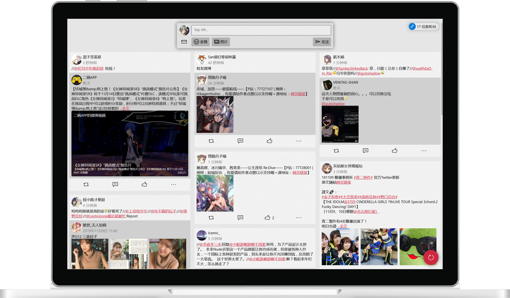
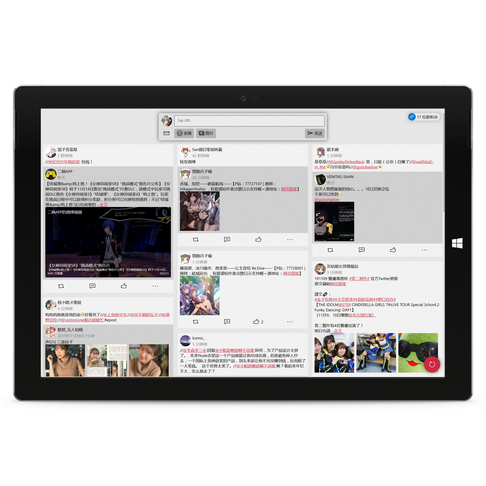
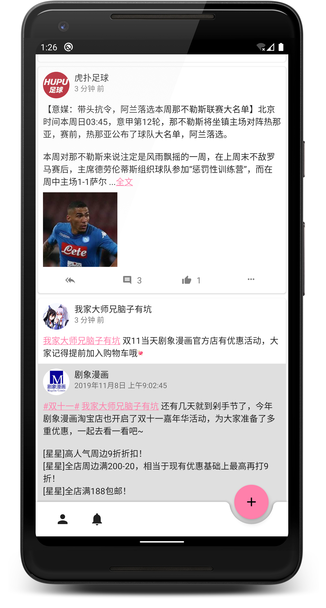

# WeiPo微博客户端
[](https://github.com/Tlaster/WeiPo/actions?workflow=UWP+CI)
[](https://github.com/Tlaster/WeiPo/actions?workflow=Android+CI)

<div align="center">

  

  <p align="center">
    
    
    
    
  </p>
  
  <p align="center">
    <a href='https://www.microsoft.com/store/apps/9MXZPMTJBL6P'></a>
    <a href='https://play.google.com/store/apps/details?id=moe.tlaster.weipo'></a>
  </p>
</div>

# FAQ
## 闪退/崩溃有点多啊
这东西刚开发没多久，不免会有一些问题，所有的崩溃/闪退记录都通过App Center记录并自动同步到了issue里，如果没有你遇到的或者你可以提供复现步骤的可以在issue里面提供
## 有功能缺失
同上，如果你需要的功能没有也可以在issue里面提交
## 我的账号安全吗？
你可以审计每一行代码，虽然写的丑了一点，如果对于任何一行的安全性有疑问欢迎开issue
## 为什么有UWP版？微软一点也不cool/微软不是倒闭了吗？
因为我能
## 有没有iOS版的计划？
由于缺少一台顶配16寸mACbOoK pRo 2019来编程和一台IpHonE 11 prO MAx来测试，目前不会有IoS版本的计划，除非有人白给
## 如何白给？
网页右上角有个Sponsor按钮，点进去即可，或者点击[这里](https://afdian.net/@Tlaster)  
# LICENSE
```
The MIT License (MIT)

Copyright (c) 2019 Tlaster

Permission is hereby granted, free of charge, to any person obtaining a copy
of this software and associated documentation files (the "Software"), to deal
in the Software without restriction, including without limitation the rights
to use, copy, modify, merge, publish, distribute, sublicense, and/or sell
copies of the Software, and to permit persons to whom the Software is
furnished to do so, subject to the following conditions:

The above copyright notice and this permission notice shall be included in all
copies or substantial portions of the Software.

THE SOFTWARE IS PROVIDED "AS IS", WITHOUT WARRANTY OF ANY KIND, EXPRESS OR
IMPLIED, INCLUDING BUT NOT LIMITED TO THE WARRANTIES OF MERCHANTABILITY,
FITNESS FOR A PARTICULAR PURPOSE AND NONINFRINGEMENT. IN NO EVENT SHALL THE
AUTHORS OR COPYRIGHT HOLDERS BE LIABLE FOR ANY CLAIM, DAMAGES OR OTHER
LIABILITY, WHETHER IN AN ACTION OF CONTRACT, TORT OR OTHERWISE, ARISING FROM,
OUT OF OR IN CONNECTION WITH THE SOFTWARE OR THE USE OR OTHER DEALINGS IN THE
SOFTWARE.
```
